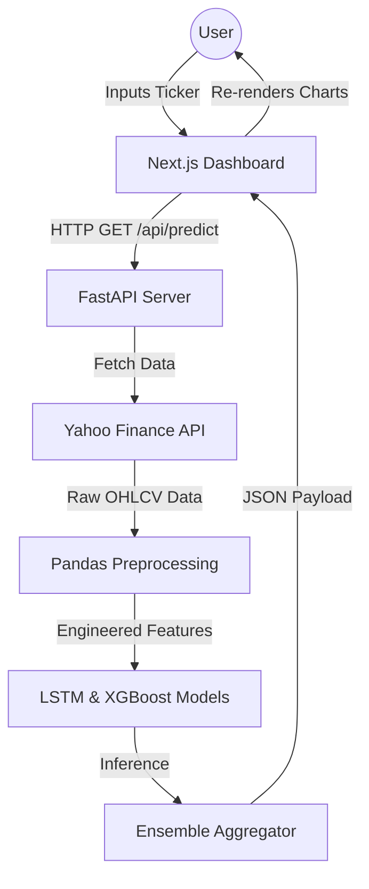

# Chapter 5: Project Design

The architectural design of the AI-Based Stock Price Trend Prediction System defines the high-level structural framework of the software, illustrating how distinct components—the frontend interface, the backend server, and the machine learning pipeline—interact harmoniously. A well-architected system ensures scalability, maintainability, and optimal performance under concurrent loads.

## 5.1 Architectural Design

This project adopts a modern, decoupled **Client-Server Architecture** utilizing a RESTful API communication protocol. This separation of concerns allows the heavy computational tasks (data processing and ML inference) to be executed on a Python backend perfectly suited for data science, while the user interface is rendered by a highly optimized Node.js framework tailored for interactive web experiences.

### The Three-Tier Architecture:

1. **Presentation Layer (Frontend - Next.js):**
   The client-facing layer is built using Next.js (React). It is responsible purely for UI rendering, state management, and user interaction. It knows nothing about how predictions are calculated; it simply sends ticker symbols to the backend and awaits a JSON response. 

2. **Application Logic Layer (Backend - FastAPI):**
   The core orchestrator. Written in Python utilizing the FastAPI framework, this layer handles all API routing, request validation, and business logic. FastAPI was chosen specifically because it is exceptionally fast, supports asynchronous programming (`asyncio`) out-of-the-box, and automatically generates interactive API documentation (Swagger UI), which is invaluable during development.

3. **Data & AI Layer (Machine Learning Engine):**
   This layer is deeply integrated with the FastAPI backend but acts as a distinct conceptual module. It consists of the `yfinance` data scrapers, the Pandas-driven ETL (Extract, Transform, Load) pipelines, and the pre-trained Scikit-Learn/TensorFlow models. It consumes raw data, executes complex tensor operations, and returns arrays of predicted values back to the Application Logic Layer.

### System Flow Diagram (Execution Flow)

## 5.2 User Interface Design

The User Interface (UI) is the bridge between the complex machine learning models and the end-user. The design philosophy centers around clarity, responsiveness, and data density without overwhelming the user. Given the target demographic (financial analysts and students), a modern, dark-themed aesthetic with vibrant chart overlays was selected.

### Key GUI Components:

1. **Global Navigation & Search Header:**
   A sticky top navigation bar allowing users to quickly input a new stock ticker. It includes a responsive search box with auto-complete functionality for popular NSE/BSE and NASDAQ tickers.

2. **Primary Dashboard Data Card:**
   Immediately below the search bar, a high-level summary card displays the current real-time price, the daily percentage change, and the model's overarching "Bullish" or "Bearish" signal.

3. **Interactive Visualization Canvas (Recharts):**
   The focal point of the UI. It features a large, interactive SVG canvas.
   - The X-axis represents Time (Dates).
   - The Y-axis represents Price (INR/USD).
   - **Historical Line:** A solid line (typically green/red depending on the trend) plotting actual historical data.
   - **Prediction Line:** A dashed line, distinctly colored (e.g., bright orange or purple), projecting into the future space of the graph.
   - **Tooltips:** Hovering over any point on the graph reveals a floating tooltip showing the exact date, price, and (in the prediction zone) the model's confidence interval.

4. **Technical Indicators Sub-Charts:**
   Optionally togglable charts situated below the main canvas that visualize MACD histograms or RSI oscillators, allowing users to verify the technical data the ML model used to generate its prediction.

5. **Model Explainability Panel:**
   A dedicated side-panel or modal that explains *why* the model made its prediction. For instance, displaying feature importance metrics from the XGBoost model (e.g., "The 20-day SMA crossover contributed most to this Bullish prediction").

### Design Considerations:
- **Responsive Layout:** The UI utilizes Tailwind CSS grid and flexbox utilities to ensure the dashboard remains highly readable on both widescreen desktop monitors and mobile devices.
- **Asynchronous Loading States:** Because ML inference can take several seconds, the UI implements skeleton loaders and spinning indicators to provide continuous visual feedback to the user, preventing the perception that the application has frozen.
