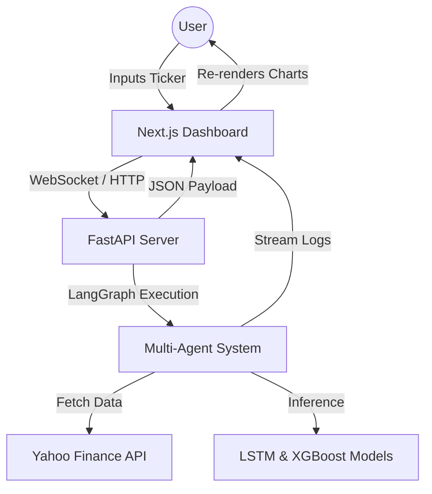

# AI-Based Stock Price Trend Prediction System

Welcome to the AI-Based Stock Price Trend Prediction System! This is a state-of-the-art, multi-agent AI system designed to forecast stock price trends, analyze market sentiment, and manage risk for Indian (NSE/BSE) and global equity markets.

Built with a decoupled **FastAPI backend** and a premium **Next.js frontend**, this system goes beyond traditional single-model predictors by utilizing a LangGraph-orchestrated team of specialized AI agents.

## 🌟 Key Features

* **Multi-Agent Architecture**: A sophisticated LangGraph state machine orchestrates three specialized agents:
  * **Technical Analyst**: Processes historical OHLCV data using `pandas-ta` to calculate RSI, MACD, and Bollinger Bands.
  * **Sentiment Analyst**: Analyzes simulated live news streams to derive market sentiment scores using NLP.
  * **Risk Manager**: Calculates optimal Stop-Loss (SL) and Take-Profit (TP) levels based on historical volatility and current market conditions.
* **Hybrid Machine Learning Pipeline**: Fuses deep learning (LSTM) for time-series forecasting with gradient boosting (XGBoost) for tabular feature extraction.
* **Explainable AI (XAI)**: Integrates SHAP-inspired logic to provide users with transparent insights into *why* the model made a specific prediction (e.g., Technicals vs. Sentiment vs. Risk).
* **Real-Time Data & WebSockets**: Fetches live ticker data via `yfinance` and streams agent collaboration thought-processes to the frontend in real-time via WebSockets.
* **Premium Dashboard**: A highly responsive, glassmorphism-styled Next.js dashboard featuring interactive SVG charts built with Recharts.

---

## 👥 Team Members

This project was developed by the following B.Tech (CSE) team from GLA University:
* **Himanshu Goyal** (2415000685)
* **Ridam Mittal** (2415001273)
* **Abhishek** (2415000041)
* **Priyanshu Yadav** (2415001214)

Under the supervision of **Dr. Sayantan Sinha & Mr. Rick Chatterjee**.

---


## 🎯 Problem Statement
Retail investors lack tools that combine technical indicators, sentiment analysis, and risk management in one place.

## 💡 Solution
This system uses a multi-agent architecture to simulate decision-making similar to professional trading systems.

---

## 🏗️ System Architecture

This project adopts a modern Three-Tier Client-Server Architecture:

1. **Presentation Layer (Next.js 15 + Tailwind CSS)**: 
   Handles UI rendering, state management, and real-time WebSocket connections. It features dynamic Recharts canvases and Framer Motion animations.
2. **Application Logic Layer (FastAPI)**:
   A high-performance asynchronous Python server that handles API routing, stateful LangGraph agent execution, and WebSocket streaming.
3. **Data & AI Layer (Scikit-Learn, TensorFlow, yfinance)**:
   Manages ETL pipelines, data scaling (MinMaxScaler), and inference from the hybrid LSTM/XGBoost models.



---

## 📂 Project Structure

```text
├── backend/                  # FastAPI Application Logic
│   ├── agents/               # LangGraph Orchestration & Agent Logic
│   │   ├── graph.py          # State machine definition
│   │   ├── risk_agent.py     # Risk Management Node
│   │   ├── sentiment_agent.py# Sentiment Analysis Node
│   │   └── technical_agent.py# Technical Analysis Node
│   ├── models/               # Hybrid ML Models (LSTM + XGBoost)
│   ├── services/             # External Integrations (yfinance)
│   ├── main.py               # FastAPI Entrypoint & WebSockets
│   └── requirements.txt      # Python Dependencies
├── frontend/                 # Next.js 15 Application
│   ├── app/                  # App Router components & pages
│   │   ├── globals.css       # Tailwind & Glassmorphism design tokens
│   │   └── page.tsx          # Main Dashboard Interface
│   ├── package.json          # Node Dependencies
│   └── tailwind.config.ts    # Tailwind Configuration
└── docs/                     # Comprehensive Academic/Project Documentation
```

---

## 🚀 Installation & Setup

### 1. Clone the Repository
```bash
git clone https://github.com/himanshugoyal2582003/ainseps.git
cd ainseps
```

### 2. Backend Setup (FastAPI)
Navigate to the root directory and install the required Python packages:

```bash
# Optional: Create a virtual environment
python -m venv .venv

# On Mac/Linux:
source .venv/bin/activate
cd ..

# On Windows (PowerShell):
.\.venv\Scripts\activate
cd ..

# Install dependencies
pip install -r backend/requirements.txt

# Run the FastAPI server
python -m uvicorn backend.main:app --host 0.0.0.0 --port 8000
```
*The backend will be available at `http://localhost:8000`. You can view the interactive API docs at `http://localhost:8000/docs`.*

### 3. Frontend Setup (Next.js)
Open a new terminal window, navigate to the `frontend` directory, and start the development server:

```bash
cd frontend

# Install Node modules
npm install

# Create environment file (.env.local)
echo NEXT_PUBLIC_API_IP= <ip address of backend server> > .env.local

its look like NEXT_PUBLIC_API_IP=<ip address of backend server>

# Start the Next.js server
npm run dev
```
*The frontend dashboard will be available at `http://localhost:3000`.*

---

### 4. Telegram Bot Setup (`t.me/ainsep_bot`)
You can interact with the system directly through Telegram!

```bash
# Set your bot token in .env (already configured):
TELEGRAM_BOT_TOKEN=8561210253:AAGKMYF8JAepMsD47j3OdY3bYmoGQhNZwhs

# Run the Telegram Bot independently:
python run_telegram_bot.py
```
*Note: Starting the FastAPI backend (`python -m uvicorn backend.main:app --port 8000`) will also automatically launch the Telegram Bot in the background!*

**Bot Features & Commands on Telegram (`@ainsep_bot`):**
- 💼 `/portfolio` - View & manage your stock watchlist stored in MongoDB.
- ➕ `/watch <ticker>` - Add stock to your account portfolio watchlist.
- ❌ `/unwatch <ticker>` - Remove stock from portfolio watchlist.
- 📄 `/pdf` - Generate & download Daily PDF Stock Intelligence Report.
- 📰 `/news <ticker>` - Scraped news with **Impact Rating** (High/Medium/Low) & **Stock Trend Direction** (Improve 🟢 vs Fall 🔴).
- 🤖 `/agent <ticker>` - Run full Multi-Agent prediction graph (Technical + Sentiment + Risk).
- ⚠️ `/alert <ticker> <limit>` - Set price fall warning threshold (e.g. `/alert RELIANCE 2850`).
- 📋 `/alerts` - View & manage active price fall warning alerts.
- 📈 `/forecast <ticker>` - 30-day XGBoost machine learning price forecast.
- 📊 `/stock <ticker>` - Real-time stock quote & day high/low/volume.
- 🎯 Interactive Stock Picker buttons & alert controls for popular equities.


---

## 📚 Comprehensive Documentation

For a deep dive into the theoretical framework, algorithmic design, and architectural decisions behind this project, please refer to the markdown files in the `docs/` folder:

* [00_Front_Matter.md](./docs/00_Front_Matter.md) - Project metadata and abstract.
* [01_Introduction.md](./docs/01_Introduction.md) - Context, problem statement, and objectives.
* [02_Literature_Review.md](./docs/02_Literature_Review.md) - Academic context and prior work.
* [03_System_Analysis.md](./docs/03_System_Analysis.md) - Functional and non-functional requirements.
* [04_Analysis_Modeling.md](./docs/04_Analysis_Modeling.md) - Data models and system flow diagrams.
* [05_Project_Design.md](./docs/05_Project_Design.md) - Detailed architectural and GUI design.
* [06_Implementation.md](./docs/06_Implementation.md) - Algorithmic mechanics (LSTM, XGBoost, ETL).
* [07_Results.md](./docs/07_Results.md) - Model evaluation metrics and outcomes.
* [08_Conclusion_and_Future_Scope.md](./docs/08_Conclusion_and_Future_Scope.md) - Final thoughts and future improvements.
* [09_Bibliography.md](./docs/09_Bibliography.md) - References and citations.

ainesp_report.pdf - Report on AI-Based Stock Price Trend Prediction System
AINSEPS.pdf - Presentation

## 🛠️ Tech Stack

- **Frontend**: Next.js 15, Tailwind CSS, Recharts, Framer Motion
- **Backend**: FastAPI, LangGraph, Python 3.10+
- **ML Models**: LSTM, XGBoost, Scikit-Learn, TensorFlow
- **Data**: yfinance

---
*Built as a cutting-edge, hackathon-ready financial intelligence platform.*
