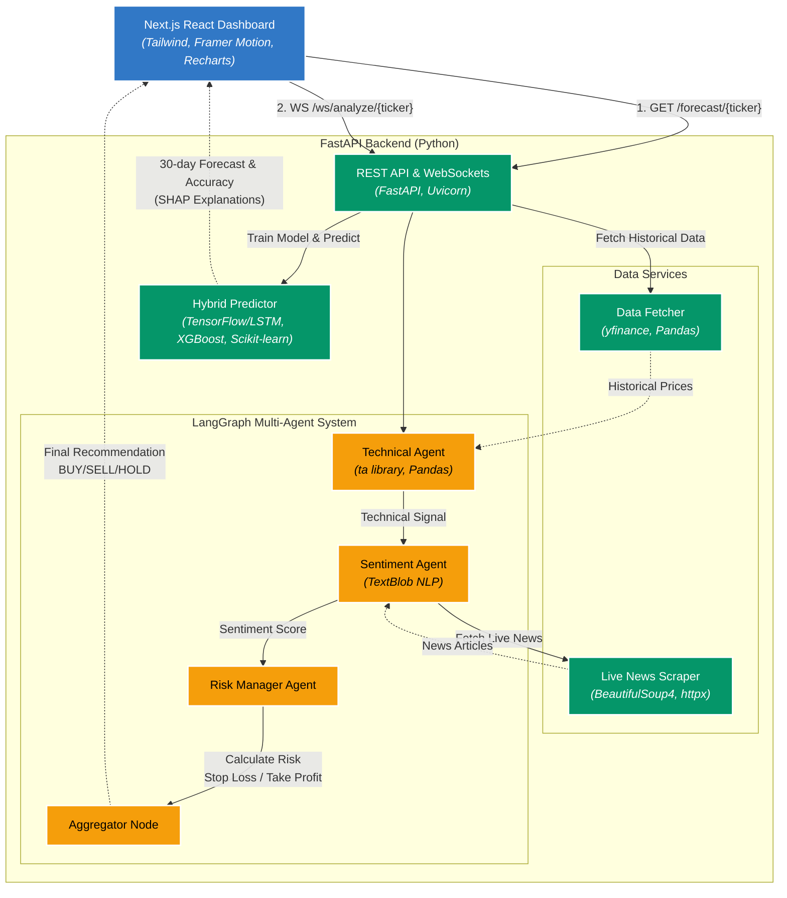

# AI Stock Prediction System Architecture

This document provides a comprehensive overview of the AI Stock Prediction System's architecture, data flows, and an exhaustive list of the technology stack used across the application.

## Comprehensive Technology Stack

### Frontend Application
- **Framework & Core**: Next.js 16+, React 19, TypeScript
- **Styling**: Tailwind CSS v4, `clsx`, `tailwind-merge`
- **Data Visualization**: Recharts (for complex historical/predictive composed charts)
- **Animations & UI**: Framer Motion (micro-animations, loading states), Lucide React (icons)
- **Tooling**: ESLint, Turbopack

### Backend Server & APIs
- **Web Framework**: FastAPI (High-performance async REST & WebSocket APIs)
- **Server**: Uvicorn
- **Real-time Communication**: `websockets` (for streaming agent analysis)
- **Environment**: `python-dotenv`

### Data Fetching & Scraping
- **Market Data**: `yfinance` (historical prices)
- **HTTP Clients**: `requests`, `httpx`
- **Web Scraping**: `beautifulsoup4`, `lxml`, `fake-useragent` (for reliable news scraping)

### Machine Learning, AI & Analysis
- **Agent Orchestration**: `langgraph`, `langchain-openai`
- **Deep Learning**: `tensorflow` (Keras LSTM models for sequence/trend prediction)
- **Gradient Boosting**: `xgboost` (for feature-based prediction refinement)
- **Machine Learning Utils**: `scikit-learn` (MinMaxScaler)
- **Explainable AI**: `shap` (Factor influence analysis)
- **Technical Analysis**: `ta` (Technical indicators like RSI/MACD)
- **Data Manipulation**: `pandas`, `numpy`
- **Natural Language Processing (NLP)**: `textblob` (Sentiment analysis on news articles)
- **Optimization**: `PyPortfolioOpt`, `PyGAD` (Genetic Algorithms for portfolio optimization)

---

## System Architecture Flowchart

The system operates using two primary flows, with the associated technologies labeled for each component:

## Detailed Data Flows

### 1. Model Training & Forecasting (`/forecast/{ticker}`)
1. The backend fetches up to 2 years of historical stock data via **yfinance** and loads it into a **Pandas** DataFrame.
2. The data is scaled using **Scikit-learn** and fed into the `HybridPredictor`.
3. The `HybridPredictor` builds a deep learning model using **TensorFlow/Keras** (LSTM layers) for time-series trends, and refines it using an **XGBoost** regressor.
4. The model backtests itself, calculates accuracy, and generates a 30-day future price prediction.
5. **SHAP** is used to explain the predictions, and the final data is sent to the **Next.js** frontend to be plotted on an interactive **Recharts** area/line chart.

### 2. Multi-Agent Analysis (`/ws/analyze/{ticker}`)
This flow uses an Agent-to-Agent (A2A) architecture orchestrated by **LangGraph**. The client connects via **WebSockets** to receive live streaming updates.
1. **Technical Agent**: Analyzes historical data using the **ta (Technical Analysis)** library to generate technical indicators (RSI, MACD) and form a baseline signal.
2. **Sentiment Agent**: Triggers the `NewsScraper` which uses **BeautifulSoup4** and **httpx** to scrape real-time articles. It then runs NLP sentiment analysis on the headlines using **TextBlob** to generate a numeric sentiment score.
3. **Risk Manager Agent**: Combines the current price, Technical Signal, and Sentiment Score to evaluate the risk level (safeguarding against market volatility).
4. **Aggregator Node**: Compiles all findings into a final recommendation verdict (e.g., STRONG BUY) and streams it back to the client.
